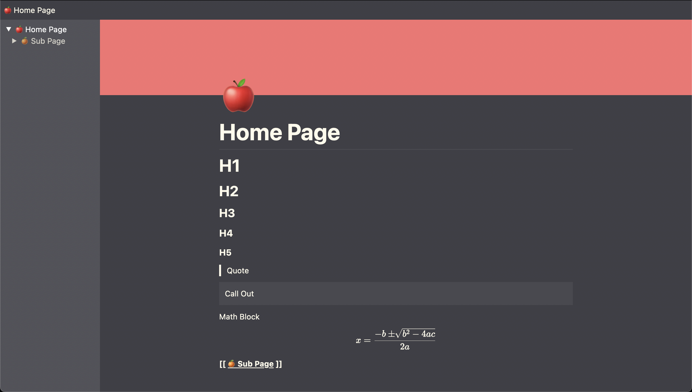

<a href="https://note-rack.erox.one/">
    <h1 align="center">
        📝 Note Rack
    </h1>
</a>

<div align="center">
    <a href="https://wakatime.com/@Eroxl"></a>
</div>



## 🌳 Features
* Markdown
    * Headings (H1 - H5)
    * Quotes
    * Call Outs
    * Math
* Inline Blocks
    * Bold
    * Italic
    * Underline
    * Strikethrough
* Other Features
    * Global Search
    * [PDF Exporting](./images/Note%20Rack%20Page.pdf)
    * [Chat GPT Integration](https://github.com/Eroxl/Note-Rack/releases/tag/v1.0.5)

## 📄 Markdown Syntax
- Headings
    - `#` - H1
    - `##` - H2
    - `###` - H3
    - `####` - H4
    - `#####` - H5
- Inline Blocks
    - `**` Bold
    - `*` Italic
    - `__` Underline
    - `--` Strikethrough
- Other
    - `>` Quote
    - `|` Callout
    - `$$` Math ([KaTeX](https://katex.org/))
    -  `[[ Page Name ]]` Page ("Page Name" can be any string)

## 🎹 Keyboard Shortcuts
- `Ctrl + F` or `Cmd + F` Global Search
- `Ctrl + P` or `Cmd + P` Save Page

## 📦 Installation
1. Clone the repo
    ```bash
    git clone https://github.com/Eroxl/Note-Rack.git
    ```

2. Navigate to the repository
    ```bash
    cd ./Note-Rack
    ```

3. Copy the server environment file and fill in the values
    ```bash
    cp ./config/.env.example ./config/.env
    ```

4. Install Docker and Docker Compose
    - [Docker](https://docs.docker.com/get-docker/)

5. Run the Docker Compose file
    ```bash
    yarn start
    ```

6. Navigate to the web application at [http://127.0.0.1:3000](http://127.0.0.1:3000)
