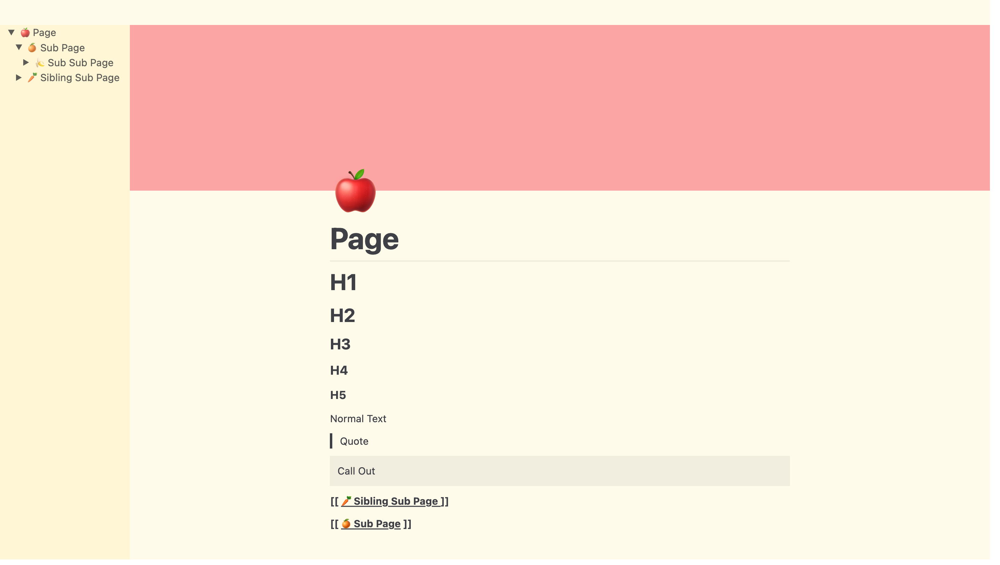
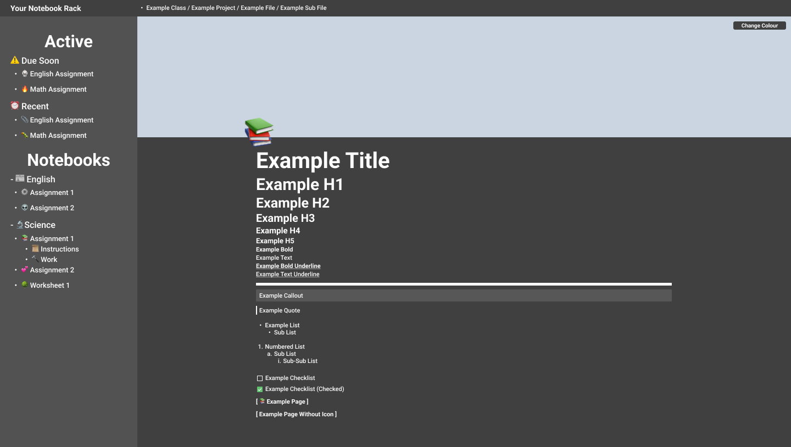

<h1 align="center">
  Note Rack
</h1>
<h6 align="center">
  The markdown editor specifically designed for students
</h6>

## Note
Please note this is still a WIP and probably wont be usable for a while. Especially some of the more advanced features.

## Goal
The goal of this project is to create a simple but robust markdown editor that is able to be used by students to simplify school work.

## Planned Features
Currently the planned features / features we hope to include in the final build are as follows

- [ ] PDF / DOCX Exporting
- [ ] Multiple Pages
  - [ ] Inline Pages
  - [ ] Page Sidebar / Selector
  - [ ] Page Navigation
- [ ] List Elements
  - [ ] Ordered Lists
    1. Example
  - [ ] Un-Ordered Lists
    * Example
  - [ ] Check Lists
    - [ ] Example
- [ ] Inline Elements
  - [ ] Bold: <b>Example</b>
  - [ ] Italic: <i>Example</i>
  - [ ] Underlined: <u>Example</u>
  - [ ] Strike Through: <s>Example</s>
- [ ] Complex Inline Elements
  - [ ] Equation Elements: 
  - [ ] Emojis: 🐛
- [ ] Block Command Menu Keybind "/"

## Current State vs. Goal

#### Current State
*light mode

#### Goal
*dark mode
